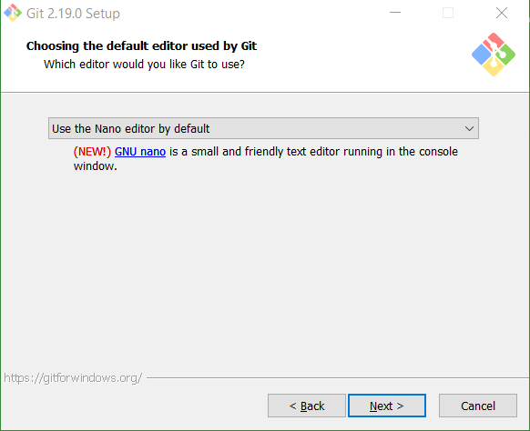
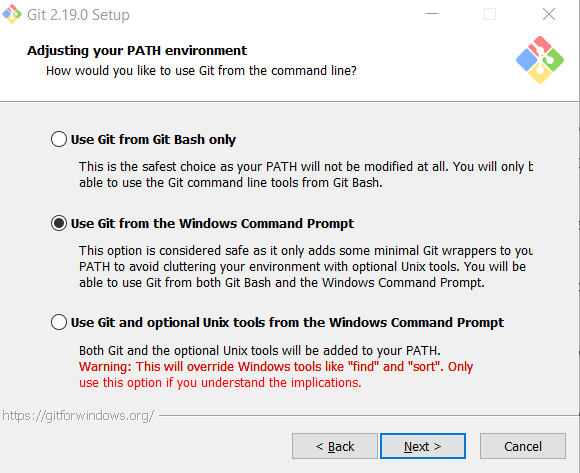

# Installation Party

We ask you to do a few things:
1. Install Python 3 interpreter, so that you can run your code.
2. Install Pycharm - a powerful programming environment to make your programming efforts easier.
3. Create an account on [Github.com](github.com).
4. Install Git.
5. Configure Git.

## Table of Contents
* [Installing Python 3](#installing-python-3)
* [Installing PyCharm](#installing-pycharm)
* [Creating Github account](#creating-github-account)
* [Installing Git](#installing-git)
* [Configuring Git](#configuring-git)

## Installing Python 3
Choose your operating system and follow the instructions:
* [Windows](#windows)
* [Linux](#linux) on an example of Ubuntu
* [Mac OS X](#mac-os-x)
* [Chrome OS](#chrome-os)
* [I can't install Python / Nothing works](#i-cant-install-python--nothing-works)

### Windows 

You can go with official Python release but we do not recommend it. Primarily, because it supports only 32-bit OS architecture. 

Instead, we recommend that you go with Anaconda distribution of Python, specifically tailored for data analysis. 
1. Go to [Anaconda download page](https://www.anaconda.com/download/).
1. Choose the Python 3.X version. At the time of writing it is version 3.6.
1. Also, choose the 64-bit installer if you have a 64-bit operating system, otherwise go with the 32-bit installer. If you are not sure which is right for you, see our [Shall I choose a 32-bit or a 64-bit installer?](os_architecture.md) page.
1. Download and run the installer. 
  * When prompted where to install Anaconda, copy the suggested location aside (we'll need it later on) OR change it to something that you will easily find afterwards (like `C:\Anaconda3`).

Once you have your Anaconda installed, there is one trick that will make your life easier. Follow these steps:

6. Press "Windows" key and search for "Edit the system environment variables".
1. In the "User variables" section (top one) 
  * press "New...". 
  * Variable name: `PYTHON3`. 
  * Variable value: `[Anaconda_dir];[Anaconda_dir]\Scripts;[Anaconda_dir]\Library\bin;` replacing `[Anaconda_dir]` with the directory you copied aside in step 5. 
  * Press "OK". You just created a new User variable `PYTHON3`. 
8. Do you have a `Path` User variable?
  * If not, press "New...". In the window that just showed set Variable name: `Path`. Variable value: `%PYTHON3%`. Press "OK". 
  * If yes, press "Edit..". In the window that just showed press "New" (that will make the last row of the table editable) and paste `%PYTHON3%` there. 
  
In the end it should look something like this:

  
Now, if everything worked fine you should be able to access Python from any location. Test it:
1. Press "Windows" key, type "cmd" (that should find a command prompt) and press Enter. 
2. type `python` and press enter
3. If everything went well you'll see something like that:
```
C:\Users\youruser>python
Python 3.6.5 |Anaconda, Inc.| (default, Mar 29 2018, 13:32:41) [MSC v.1900 64 bit (AMD64)] on win32
Type "help", "copyright", "credits" or "license" for more information.
>>>
```
Type `quit()` to exit Python interpreter, and `exit` to shut down the command prompt window.

4. If you see this:
```
C:\Users\youruser>python
'python' is not recognized as an internal or external command,
operable program or batch file.
```
then something went wrong. Try again or search for support on our Slack.

### Linux

First things first, open the terminal. To do so press the meta key and type `terminal` in the search box. Double click on it to open. 

Ubuntu (at least as of 16.04 LTE) ships with both Python 3 and Python 2 pre-installed. To make sure our versions are up-to-date copy and paste the following commands to the terminal:
```
sudo apt-get update
sudo apt-get upgrade
```
typing in your password and agreeing when necessary.

Once the process is complete, check the version of Python 3 that is installed in the system by typing:

```
python3 -V
```

The output in the terminal window will let you know the version number. The version number may vary, but it will look similar to this:

```
Python 3.6.5
```

To manage software packages for Python, install pip:

```
sudo apt-get install -y python3-pip
```

Congratulations, your Python installation is complete and you're ready to roll! 

Note: pip installs and manages programming packages one may want to use in their development projects. You can install Python packages by typing:

```
pip3 install package_name
```

Here, `package_name` can refer to any Python package or library, such as Django for web development or NumPy for scientific computing. So if you would like to install NumPy, you can do so with the command `pip3 install numpy`.


### Mac OS X

Although Mac OS X comes with Python pre-installed, it is a wrong version of Python (2.7) and we need to install a new one (3.X, currently 3.6 or 3.7). 

1. Install Xcode: It is required to install Homebrew and Python. Download it from the App store. After a lengthy download and install process, open a terminal. To open a terminal: open the Launchpad from the Dock and type `terminal` in the search box. Click on it to open. 

 Type the following command into terminal to install Xcode Command Line tools. They are required for Homebrew:

```
xcode-select —-install
```
2. Install Homebrew: Go to [Homebrew website](https://brew.sh) and follow the instructions to install it.

3. Install Python: Now that Homebrew is installed, use it to install python. The OSX system will still use the built-in system python, but anything you do will use the newly installed python. In the terminal type
```
brew install python3
```

4. Finally, upgrade you Python package manager called `pip` to the latest version: 

```
pip3 install -U pip3
```
and you're done!

Note: pip installs and manages programming packages one may want to use in their development projects. You can install Python packages by typing:

```
pip3 install package_name
```

Here, `package_name` can refer to any Python package or library, such as Django for web development or NumPy for scientific computing. So if you would like to install NumPy, you can do so with the command `pip3 install numpy`.

### Chrome OS

For instructions please [see this thread on StackExchange](https://unix.stackexchange.com/questions/84160/running-python-on-chromeos). 

### I can't install Python / Nothing works

Another available option is to use a browser-based environment. We recommend [codenvy.com](https://codenvy.com/). It is quick to set up and will allow you to follow along the workshop.

## Installing PyCharm

PyCharm is an [Integrated Development Enviroment (IDE)](https://en.wikipedia.org/wiki/Integrated_development_environment)) for Python that allows you to write, run and debug code, easily intergrate your projects with remote repositories, and many more.

Below are instructions for various operating systems. If you are running on Windows or you OS is not listed then follow the instructions in the [Direct download section](#direct-download).

### Ubuntu

In "Ubuntu Software" search for "PyCharm CE". If available install it. If not, follow the instructions in the [Direct download section](#direct-download).

### Mac OS X

In "App Store" search for "PyCharm CE" or "PyCharm Community Edition". If available install it from there.

If not, follow the instructions in the [Direct download section](#direct-download).

### Direct download 

If running on Ubuntu or Mac OS check for PyCharm community edition in . If available, it is okay to install it from the store.

From the [download page of PyCharm](https://www.jetbrains.com/pycharm/download/) download the **Community** edition for your OS. Run the installer. 

## Creating Github account

During the workshop we will be making use of git and of Github.

[Git](https://en.wikipedia.org/wiki/Git) is a version control system for tracking changes in computer files and coordinating work on those files among multiple people. It is primarily used for source code management in software development, but it can be used to keep track of changes in any set of files.

[Github](http://github.com) is a web-based hosting service for version control using Git. 

To create an account on Github:
1. Go to [github.com](github.com)
2. Fill in the form and "Sign up for Github".


## Installing Git


### Windows

There are also a few ways to install Git on Windows. The most official build is available for download on the Git website. Just go to [http://git-scm.com/download/win](http://git-scm.com/download/win) and the download will start automatically. 

Run the installer. 

When asked about editor, choose Nano



When asked about adjusting your Path environment choose the second option



For other settings go with the default (preselected) values.

### Linux

You can install Git through the package management tool that comes with your distribution. If you’re on Fedora (or any closely-related RPM-based distribution, such as RHEL or CentOS), you can use dnf:
```
$ sudo dnf install git-all
```

If you’re on a Debian-based distribution, such as Ubuntu, try apt:
```
$ sudo apt install git-all
```


### Mac OS X

You can install Git with Homebrew:
```
brew install git
```

## Configuring Git

Open terminal / command line, that is:
* [Windows] Press Windows key, type `cmd` and press enter.
* [Linux] Press Meta key, type `terminal` and press enter  / click on the application. 
* [Mac OS X] Go to Launchpad, type `terminal` in the search and press enter / click on the application. 

Type in the following, replacing YOUR_NAME with your name and YOUR_EMAIL with your email that you used on GitHub:
```
git config --global user.name YOUR_NAME
git config --global user.email YOUR_EMAIL
```
